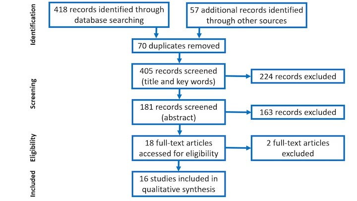
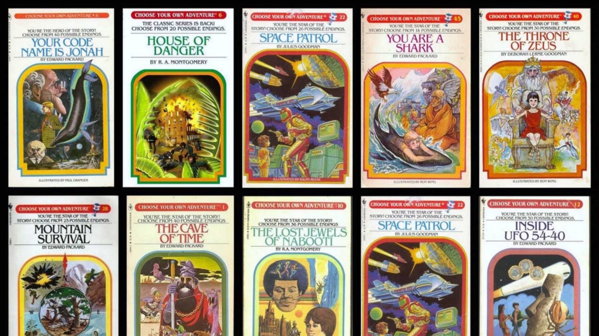

```{r setup, include=FALSE}
usethis::use_git_ignore(c("*.csv", "*.rds"))
options(htmltools.dir.version = FALSE)

library(knitr)
library(tidyverse)
library(xaringan)
library(fontawesome)
```

class: inverse, center, middle

# `r fa("fas fa-images", fill = "#fff")`

**View the slides:** 

[bretsw.com/eme6665-ss26-module3](https://bretsw.com/eme6665-ss26-module3)


---

class: inverse, center, middle

# `r fa("fas fa-comments", fill = "#fff")` <br><br> Module 2 <br> Recap

---

# `r fa("fas fa-comments", fill = "#fff")` Screening

```{r, out.width = "480px", echo = FALSE, fig.align = "center"}
include_graphics("img/filter.jpg")
```

--

**Practical screening:** (Fink, 2020)

--

- Publication date: **year > 2020** (within the past 5 years)

--

- Source: Peer-reviewed journal articles, **impact factor > 1** (see FSU Libraries' [Academic Publishing Guide](https://guides.lib.fsu.edu/academicpublishing/citationanalysis)

---

# `r fa("fas fa-comments", fill = "#fff")` Screening

```{r, out.width = "480px", echo = FALSE, fig.align = "center"}
include_graphics("img/filter.jpg")
```

**Methodological screening:** (Fink, 2020)

--

- Population and setting

--

- Date of data collection

--

- Paradigm and methodology

--

- Evidence supporting claims (trustworthiness, validity, reliability)

---

# `r fa("fas fa-comments", fill = "#fff")` Structuring the Dissertation

```{r, out.width = "640px", echo = FALSE, fig.align = "center"}
include_graphics("img/build.jpg")
```

- Follow the [FSU template for dissertations](https://gradschool.fsu.edu/current-students/thesis-treatise-and-dissertation/templates-formatting-assistance) (for formatting, not for content or sections)

--

- Use APA style (citations, formatting, voice, tense)

---

# `r fa("fas fa-comments", fill = "#fff")` Good Writing

```{r, out.width = "480px", echo = FALSE, fig.align = "center"}
include_graphics("img/write.jpg")
```

--

- Clearly define your concepts

--

- Clearly state the problem, your purpose, and the research questions

--

- Clearly describe your processes for reviewing the literature and selecting your methods

--

- Be consistent (use the same terms and phrases over and over)


---

class: inverse, center, middle

# `r fa("fas fa-magnifying-glass", fill = "#fff")` <br><br> Module 3:<br>Systematic Not Automatic

---

# `r fa("fas fa-magnifying-glass", fill = "#fff")` Starting Your Search

```{r, out.width = "540px", echo = FALSE, fig.align = "center"}
include_graphics("img/search1.jpg")
```

--

1. Generative AI: [Google Gemini](https://gemini.google.com/) | 
[Microsoft Copilot](https://copilot.microsoft.com/)

--

2. Web Search: [google.com](https://www.google.com/) | [duckduckgo](https://duckduckgo.com/)

--

3. Wikipedia: [wikipedia.org](https://www.wikipedia.org/)

---

# `r fa("fas fa-magnifying-glass", fill = "#fff")` Searching the Literature

```{r, out.width = "540px", echo = FALSE, fig.align = "center"}

```

--

1. Google Scholar: [scholar.google.com](https://scholar.google.com/)

--

2. Databases (FSU library OneSearch: [lib.fsu.edu](https://www.lib.fsu.edu/))

--

3. **Systematic Literature Reviews**


---


# `r fa("fas fa-book-open", fill = "#fff")` Types of Reviews

### Reading 3.2. Sutton et al. (2019)

--

- Narrative review

--

- Systematic review

--

- Meta-analysis

--

- Umbrella review

--

- Critical review

---

# `r fa("fas fa-book-open", fill = "#fff")` Types of Reviews

### Reading 3.2. Sutton et al. (2019)

- **Narrative review**

- Systematic review

- Meta-analysis

- Umbrella review

- Critical review

---

# `r fa("fas fa-book-open", fill = "#fff")` Types of Reviews

### Reading 3.2. Sutton et al. (2019)

- **Narrative review**

- **Systematic review**

- Meta-analysis

- Umbrella review

- Critical review


---

# `r fa("fas fa-book-open", fill = "#fff")` Systematic Reviews

### System ~ Gears?

```{r, out.width = "720px", echo = FALSE, fig.align = "center"}
include_graphics("img/3-gears.jpg")
```

---

# `r fa("fas fa-book-open", fill = "#fff")` Systematic Reviews

### System ~ Mise En Place?

```{r, out.width = "720px", echo = FALSE, fig.align = "center"}
include_graphics("img/3-mise-en-place.jpg")
```

---

# `r fa("fas fa-book-open", fill = "#fff")` Systematic Reviews

### System ~ Preparation Process

```{r, out.width = "720px", echo = FALSE, fig.align = "center"}
include_graphics("img/3-prep.jpg")
```

---

# `r fa("fas fa-book-open", fill = "#fff")` Systematic Reviews

### Systematic review ~ Intentional, structured, rigorous search

```{r, out.width = "720px", echo = FALSE, fig.align = "center"}
include_graphics("img/3-prep.jpg")
```

---

# `r fa("fas fa-book-open", fill = "#fff")` Systematic Reviews

### System ~ Preparation Process: PRISMA standards

```{r, out.width = "720px", echo = FALSE, fig.align = "center"}

```

<hr>

Staudt Willet, K. B., & He, D. (2024). Educators’ invisible labor: A systematic review. *Review of Education, 12*(2), e3473. doi:[10.1002/rev3.3473](https://doi.org/10.1002/rev3.3473)

---

# `r fa("fas fa-book-open", fill = "#fff")` Systematic Reviews

### System ~ Preparation Process: PRISMA Example

```{r, out.width = "420px", echo = FALSE, fig.align = "center"}
include_graphics("img/3-articles-intersections.png")
```

<hr>

Staudt Willet, K. B., & He, D. (2024). Educators’ invisible labor: A systematic review. *Review of Education, 12*(2), e3473. doi:[10.1002/rev3.3473](https://doi.org/10.1002/rev3.3473)


---

# `r fa("fas fa-book-open", fill = "#fff")` Systematic Reviews

### Reading 3.4.-3.8. Choose-Your-Own-Adventure

```{r, out.width = "100%", echo = FALSE, fig.align = "center"}

```

---

# `r fa("fas fa-book-open", fill = "#fff")` Systematic Reviews

### Readings 3.4.-3.8. Choose-Your-Own-Adventure

```{r, out.width = "600px", echo = FALSE, fig.align = "center"}
include_graphics("img/choose.jpg")
```

--

- Pick a **systematic literature review** relevant to your research topic

--

- Read **5 articles** cited in the review article


---

class: inverse, center, middle

# `r fa("fas fa-binoculars", fill = "#fff")` <br><br> Looking ahead

---

# `r fa("fas fa-calendar-day", fill = "#fff")` Semester schedule

- Module 1: Threads of Chapter One

- Module 2: Do You Trust Me?

- **Module 3: Systematic Not Automatic**

- Module 4: Synthesis Over Summary

- Module 5: Elements of Style (for Academic Writing)

- Module 6: Weaving Together Chapter One

- Module 7: Beauty is in Revision


---

# `r fa("fas fa-keyboard", fill = "#fff")` Assignment: Research Outline

```{r, out.width = "480px", echo = FALSE, fig.align = "center"}
include_graphics("img/write.jpg")
```

### Goal: Look at the big picture of Chapter One

--

- Create a complete outline of your whole chapter one in a bullet-point list. 

--

- Write one sentence for each bullet point.

--

-  Follow the outline on Canvas.

---

# `r fa("fas fa-keyboard", fill = "#fff")` Assignment: Research Outline

  - **Introduction**
    - Topic
    - Problem
    - Purpose

--

  - **Literature Review**
    - First Subsection: Main Theme in the Literature \#1
      - One sentence: First supporting point contributing to first theme
      - One sentence: Second supporting point contributing to first theme
      - One sentence: Third supporting point contributing to first theme

--

  - **Conceptual Foundation**
    - One sentence: What is the study's point of view or starting point?
    - One sentence: How appropriate is this foundation?

--

  - **Research Questions**
    - **Purpose**
      - One sentence: repeat the purpose statement from the Introduction
    - RQ1
    - RQ2
    - RQ3
    - **Significance**
      - One sentence: How will the purpose be achieved? So what?


---

class: inverse, center, middle

# `r fa("fas fa-question", fill = "#fff")` <br><br> Questions

<hr>

**What questions can I answer for you now?**

**How can I support you this week?**

<hr>

`r fa("envelope", fill = "#fff")` [bret.staudtwillet@fsu.edu](mailto:bret.staudtwillet@fsu.edu) | `r fa("globe", fill = "#fff")` [bretsw.com](https://bretsw.com) | `r fa("fab fa-github", fill = "#fff")` [GitHub](https://github.com/bretsw/)